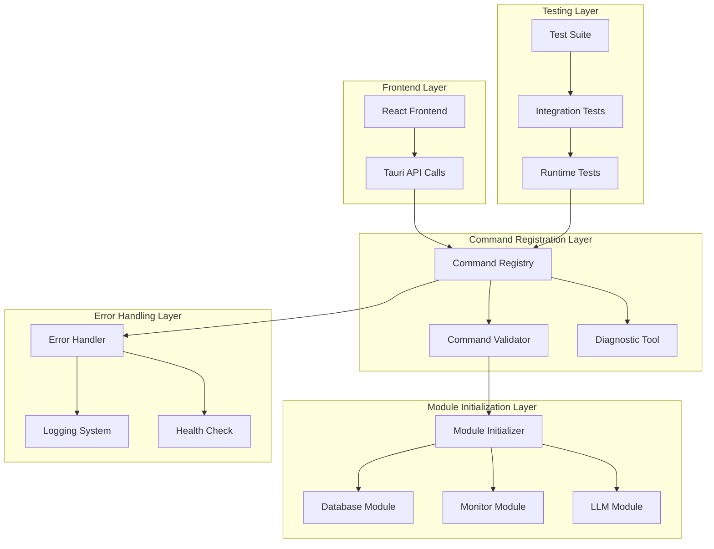

# Design Document

## Overview

本设计文档描述了修复 Tauri 应用中命令注册问题的技术方案。通过分析当前的错误模式，我们发现问题的根本原因是模块依赖初始化顺序和命令注册机制的不完善。

解决方案采用分层架构，包括诊断层、修复层、验证层和监控层，确保所有 Tauri 命令能够正确注册并被前端调用。

## Architecture



## Components and Interfaces

### 1. Command Registry Enhanced (命令注册增强器)

**职责**: 管理所有 Tauri 命令的注册和验证

```rust
pub struct CommandRegistry {
    registered_commands: HashMap<String, CommandInfo>,
    failed_commands: Vec<CommandError>,
    initialization_order: Vec<String>,
}

pub struct CommandInfo {
    name: String,
    handler: Box<dyn Fn() -> Result<(), CommandError>>,
    dependencies: Vec<String>,
    status: CommandStatus,
    last_verified: SystemTime,
}

pub enum CommandStatus {
    Registered,
    Failed(String),
    Unverified,
    Disabled,
}

impl CommandRegistry {
    pub fn new() -> Self;
    pub fn register_command(&mut self, info: CommandInfo) -> Result<(), CommandError>;
    pub fn verify_all_commands(&self) -> Vec<CommandError>;
    pub fn get_command_status(&self, name: &str) -> Option<CommandStatus>;
    pub fn list_available_commands(&self) -> Vec<String>;
}
```

### 2. Module Initializer (模块初始化器)

**职责**: 按正确顺序初始化所有依赖模块

```rust
pub struct ModuleInitializer {
    modules: HashMap<String, Box<dyn Module>>,
    dependency_graph: DependencyGraph,
    initialization_state: HashMap<String, InitState>,
}

pub trait Module {
    fn name(&self) -> &str;
    fn dependencies(&self) -> Vec<String>;
    fn initialize(&mut self) -> Result<(), ModuleError>;
    fn health_check(&self) -> Result<(), ModuleError>;
    fn shutdown(&mut self) -> Result<(), ModuleError>;
}

pub enum InitState {
    Pending,
    Initializing,
    Ready,
    Failed(String),
}

impl ModuleInitializer {
    pub fn new() -> Self;
    pub fn register_module(&mut self, module: Box<dyn Module>) -> Result<(), ModuleError>;
    pub fn initialize_all(&mut self) -> Result<(), Vec<ModuleError>>;
    pub fn get_initialization_order(&self) -> Vec<String>;
    pub fn health_check_all(&self) -> HashMap<String, Result<(), ModuleError>>;
}
```

### 3. Diagnostic Tool (诊断工具)

**职责**: 提供命令注册问题的诊断和分析

```rust
pub struct DiagnosticTool {
    registry: Arc<CommandRegistry>,
    initializer: Arc<ModuleInitializer>,
}

pub struct DiagnosticReport {
    timestamp: SystemTime,
    registered_commands: Vec<String>,
    failed_commands: Vec<CommandError>,
    module_states: HashMap<String, InitState>,
    recommendations: Vec<String>,
}

impl DiagnosticTool {
    pub fn new(registry: Arc<CommandRegistry>, initializer: Arc<ModuleInitializer>) -> Self;
    pub fn run_full_diagnostic(&self) -> DiagnosticReport;
    pub fn check_command(&self, name: &str) -> CommandDiagnostic;
    pub fn suggest_fixes(&self, errors: &[CommandError]) -> Vec<String>;
    pub fn export_report(&self, format: ReportFormat) -> Result<String, DiagnosticError>;
}
```

### 4. Enhanced Error Handler (增强错误处理器)

**职责**: 提供详细的错误信息和恢复建议

```rust
pub struct EnhancedErrorHandler {
    logger: Arc<dyn Logger>,
    error_patterns: HashMap<String, ErrorPattern>,
}

pub struct ErrorPattern {
    pattern: Regex,
    category: ErrorCategory,
    recovery_suggestions: Vec<String>,
    severity: ErrorSeverity,
}

pub enum ErrorCategory {
    CommandNotFound,
    ModuleInitializationFailed,
    DependencyMissing,
    RuntimeError,
}

impl EnhancedErrorHandler {
    pub fn new(logger: Arc<dyn Logger>) -> Self;
    pub fn handle_command_error(&self, error: &CommandError) -> ErrorResponse;
    pub fn categorize_error(&self, error: &str) -> ErrorCategory;
    pub fn get_recovery_suggestions(&self, category: ErrorCategory) -> Vec<String>;
    pub fn log_error_with_context(&self, error: &CommandError, context: &ErrorContext);
}
```

### 5. Command Validator (命令验证器)

**职责**: 验证命令的可用性和正确性

```rust
pub struct CommandValidator {
    test_cases: HashMap<String, Vec<TestCase>>,
    validation_rules: Vec<ValidationRule>,
}

pub struct TestCase {
    name: String,
    input: serde_json::Value,
    expected_result: TestExpectation,
    timeout: Duration,
}

pub enum TestExpectation {
    Success,
    Error(String),
    Timeout,
}

impl CommandValidator {
    pub fn new() -> Self;
    pub fn add_test_case(&mut self, command: &str, test_case: TestCase);
    pub fn validate_command(&self, command: &str) -> ValidationResult;
    pub fn validate_all_commands(&self) -> HashMap<String, ValidationResult>;
    pub fn run_integration_tests(&self) -> IntegrationTestResult;
}
```

## Data Models

### Command Information Model

```rust
#[derive(Debug, Clone, Serialize, Deserialize)]
pub struct CommandMetadata {
    pub name: String,
    pub description: String,
    pub parameters: Vec<ParameterInfo>,
    pub return_type: String,
    pub dependencies: Vec<String>,
    pub version: String,
    pub deprecated: bool,
}

#[derive(Debug, Clone, Serialize, Deserialize)]
pub struct ParameterInfo {
    pub name: String,
    pub param_type: String,
    pub required: bool,
    pub description: String,
    pub default_value: Option<serde_json::Value>,
}
```

### Module Dependency Model

```rust
#[derive(Debug, Clone)]
pub struct DependencyGraph {
    nodes: HashMap<String, ModuleNode>,
    edges: Vec<DependencyEdge>,
}

#[derive(Debug, Clone)]
pub struct ModuleNode {
    name: String,
    module_type: ModuleType,
    priority: u32,
    required: bool,
}

#[derive(Debug, Clone)]
pub struct DependencyEdge {
    from: String,
    to: String,
    dependency_type: DependencyType,
}

pub enum DependencyType {
    Hard,      // 必须依赖
    Soft,      // 可选依赖
    Circular,  // 循环依赖（需要特殊处理）
}
```

## Correctness Properties

*A property is a characteristic or behavior that should hold true across all valid executions of a system-essentially, a formal statement about what the system should do. Properties serve as the bridge between human-readable specifications and machine-verifiable correctness guarantees.*

### Property Analysis

<function_calls>
<invoke name="prework">
<parameter name="featureName">fix-command-registration

### Property Reflection

After analyzing all acceptance criteria, I identified several properties that can be consolidated to avoid redundancy:

- Properties 1.2, 2.2, and 2.4 all relate to startup validation and can be combined into a comprehensive startup validation property
- Properties 1.3 and 4.1 both relate to error logging and can be combined into a comprehensive error logging property  
- Properties 2.3 and 3.3 both relate to failure handling and can be combined into a failure handling property
- Properties 3.1, 3.2, and 3.4 all relate to module initialization order and can be combined into an initialization order property

### Core Properties

Property 1: Invalid command error handling
*For any* invalid command name, when called by the frontend, the backend should return an error message that includes a list of available commands
**Validates: Requirements 1.1**

Property 2: Command registry completeness  
*For any* command defined in commands.rs with the #[tauri::command] attribute, the command registry should contain that command
**Validates: Requirements 2.1**

Property 3: Comprehensive startup validation
*For any* system startup, all registered commands should have their dependencies verified, modules should be initialized in correct order, and each command's callability should be validated
**Validates: Requirements 1.2, 2.2, 2.4**

Property 4: Module initialization order correctness
*For any* module with dependencies, the module should only be initialized after all its dependencies have been successfully initialized
**Validates: Requirements 3.1, 3.2, 3.4**

Property 5: Comprehensive error logging
*For any* command registration failure or command execution failure, the system should log detailed error information including failure reasons and call stack where applicable
**Validates: Requirements 1.3, 4.1**

Property 6: Error categorization accuracy
*For any* error that occurs, the logging system should correctly categorize it as either a command registration error or command execution error
**Validates: Requirements 4.2**

Property 7: Failure handling with recovery
*For any* module initialization failure or critical dependency failure, the system should either provide a degradation strategy or refuse to start with clear error information
**Validates: Requirements 2.3, 3.3**

Property 8: Friendly error messages for invalid commands
*For any* non-existent command called by the frontend, the backend should return a user-friendly error message
**Validates: Requirements 4.3**

Property 9: Test suite completeness
*For any* registered command, the test suite should include availability tests for that command
**Validates: Requirements 5.1**

Property 10: Test automation for new commands
*For any* newly added command, the test suite should automatically include availability tests for that command
**Validates: Requirements 5.2**

Property 11: Test responsiveness to dependency changes
*For any* change to a command's module dependencies, the test suite should verify that the command remains available
**Validates: Requirements 5.4**

Property 12: Command status query completeness
*For any* command status request, the system should return the command's registration status, dependency status, and last call time
**Validates: Requirements 6.2**

Property 13: Alert triggering for command anomalies
*For any* command with abnormal status, the system should trigger appropriate alert mechanisms
**Validates: Requirements 6.4**

## Error Handling

### Error Categories and Recovery Strategies

1. **Command Not Found Errors**
   - **Detection**: Frontend calls non-existent command
   - **Response**: Return error with available commands list
   - **Recovery**: Guide user to correct command name
   - **Logging**: Log invalid command attempts for analysis

2. **Module Initialization Failures**
   - **Detection**: Module fails during startup initialization
   - **Response**: Refuse to start or provide degraded functionality
   - **Recovery**: Retry initialization or fallback to safe mode
   - **Logging**: Log detailed initialization failure reasons

3. **Dependency Resolution Failures**
   - **Detection**: Circular dependencies or missing dependencies
   - **Response**: Clear error message with dependency chain
   - **Recovery**: Suggest dependency resolution steps
   - **Logging**: Log dependency graph analysis results

4. **Runtime Command Failures**
   - **Detection**: Command execution throws exception
   - **Response**: Structured error response with context
   - **Recovery**: Suggest alternative approaches or retry
   - **Logging**: Log with full call stack and context

### Error Response Format

```rust
#[derive(Debug, Serialize)]
pub struct CommandErrorResponse {
    pub error_type: ErrorType,
    pub message: String,
    pub details: Option<String>,
    pub available_commands: Option<Vec<String>>,
    pub recovery_suggestions: Vec<String>,
    pub error_code: String,
    pub timestamp: SystemTime,
}

pub enum ErrorType {
    CommandNotFound,
    ModuleNotInitialized,
    DependencyMissing,
    ValidationFailed,
    RuntimeError,
}
```

## Testing Strategy

### Dual Testing Approach

The testing strategy employs both unit tests and property-based tests to ensure comprehensive coverage:

**Unit Tests**: Focus on specific examples, edge cases, and error conditions
- Test specific command registration scenarios
- Test module initialization sequences
- Test error handling for known failure cases
- Test diagnostic tool functionality

**Property-Based Tests**: Verify universal properties across all inputs
- Generate random invalid command names and verify error responses
- Test module initialization order with various dependency configurations
- Verify error logging completeness across different failure scenarios
- Test command registry completeness with dynamically generated command sets

### Property-Based Testing Configuration

- **Testing Framework**: Use `proptest` crate for Rust property-based testing
- **Test Iterations**: Minimum 100 iterations per property test
- **Test Tagging**: Each property test references its design document property
  - Format: **Feature: fix-command-registration, Property {number}: {property_text}**

### Test Implementation Requirements

1. **Command Registration Tests**
   - Property tests for command registry completeness
   - Unit tests for specific registration failure scenarios
   - Integration tests for end-to-end command calling

2. **Module Initialization Tests**
   - Property tests for initialization order correctness
   - Unit tests for specific dependency scenarios
   - Stress tests for concurrent initialization

3. **Error Handling Tests**
   - Property tests for error message completeness
   - Unit tests for specific error categories
   - Integration tests for error recovery mechanisms

4. **Diagnostic Tool Tests**
   - Unit tests for diagnostic report generation
   - Property tests for recommendation accuracy
   - Performance tests for large-scale diagnostics

### Test Data Generation

```rust
// Property test generators for command testing
use proptest::prelude::*;

prop_compose! {
    fn arb_invalid_command_name()(
        name in "[a-zA-Z_][a-zA-Z0-9_]*"
    ) -> String {
        // Generate command names that don't exist in registry
        format!("invalid_{}", name)
    }
}

prop_compose! {
    fn arb_module_dependency_graph()(
        modules in prop::collection::vec(arb_module_name(), 3..10),
        dependencies in prop::collection::vec(arb_dependency_edge(), 2..15)
    ) -> DependencyGraph {
        DependencyGraph::new(modules, dependencies)
    }
}
```

This comprehensive testing approach ensures that all correctness properties are validated through automated testing, providing confidence in the command registration system's reliability and robustness.